| Icon  | Index | DLL |
| --- | --- | --- |
|  | 000 | imageres.dll |
|  | 001 | imageres.dll |
|  | 002 | imageres.dll |
|  | 003 | imageres.dll |
|  | 004 | imageres.dll |
|  | 005 | imageres.dll |
|  | 006 | imageres.dll |
|  | 007 | imageres.dll |
|  | 008 | imageres.dll |
|  | 009 | imageres.dll |
|  | 010 | imageres.dll |
| 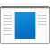 | 011 | imageres.dll |
|  | 012 | imageres.dll |
|  | 013 | imageres.dll |
|  | 014 | imageres.dll |
|  | 015 | imageres.dll |
|  | 016 | imageres.dll |
|  | 017 | imageres.dll |
|  | 018 | imageres.dll |
|  | 019 | imageres.dll |
|  | 020 | imageres.dll |
|  | 021 | imageres.dll |
|  | 022 | imageres.dll |
|  | 023 | imageres.dll |
|  | 024 | imageres.dll |
|  | 025 | imageres.dll |
|  | 026 | imageres.dll |
|  | 027 | imageres.dll |
|  | 028 | imageres.dll |
|  | 029 | imageres.dll |
|  | 030 | imageres.dll |
|  | 031 | imageres.dll |
|  | 032 | imageres.dll |
|  | 033 | imageres.dll |
|  | 034 | imageres.dll |
|  | 035 | imageres.dll |
|  | 036 | imageres.dll |
|  | 037 | imageres.dll |
|  | 038 | imageres.dll |
|  | 039 | imageres.dll |
|  | 040 | imageres.dll |
|  | 041 | imageres.dll |
|  | 042 | imageres.dll |
|  | 043 | imageres.dll |
|  | 044 | imageres.dll |
|  | 045 | imageres.dll |
|  | 046 | imageres.dll |
|  | 047 | imageres.dll |
|  | 048 | imageres.dll |
|  | 049 | imageres.dll |
|  | 050 | imageres.dll |
|  | 051 | imageres.dll |
|  | 052 | imageres.dll |
|  | 053 | imageres.dll |
|  | 054 | imageres.dll |
|  | 055 | imageres.dll |
|  | 056 | imageres.dll |
|  | 057 | imageres.dll |
|  | 058 | imageres.dll |
|  | 059 | imageres.dll |
|  | 060 | imageres.dll |
|  | 061 | imageres.dll |
|  | 062 | imageres.dll |
|  | 063 | imageres.dll |
|  | 064 | imageres.dll |
|  | 065 | imageres.dll |
|  | 066 | imageres.dll |
|  | 067 | imageres.dll |
|  | 068 | imageres.dll |
|  | 069 | imageres.dll |
|  | 070 | imageres.dll |
|  | 071 | imageres.dll |
|  | 072 | imageres.dll |
|  | 073 | imageres.dll |
|  | 074 | imageres.dll |
|  | 075 | imageres.dll |
|  | 076 | imageres.dll |
|  | 077 | imageres.dll |
|  | 078 | imageres.dll |
|  | 079 | imageres.dll |
|  | 080 | imageres.dll |
|  | 081 | imageres.dll |
|  | 082 | imageres.dll |
|  | 083 | imageres.dll |
|  | 084 | imageres.dll |
|  | 085 | imageres.dll |
|  | 086 | imageres.dll |
|  | 087 | imageres.dll |
|  | 088 | imageres.dll |
|  | 089 | imageres.dll |
|  | 090 | imageres.dll |
|  | 091 | imageres.dll |
|  | 092 | imageres.dll |
|  | 093 | imageres.dll |
|  | 094 | imageres.dll |
|  | 095 | imageres.dll |
|  | 096 | imageres.dll |
|  | 097 | imageres.dll |
|  | 098 | imageres.dll |
|  | 099 | imageres.dll |
|  | 100 | imageres.dll |
|  | 101 | imageres.dll |
|  | 102 | imageres.dll |
|  | 103 | imageres.dll |
|  | 104 | imageres.dll |
|  | 105 | imageres.dll |
|  | 106 | imageres.dll |
|  | 107 | imageres.dll |
|  | 108 | imageres.dll |
|  | 109 | imageres.dll |
|  | 110 | imageres.dll |
|  | 111 | imageres.dll |
|  | 112 | imageres.dll |
|  | 113 | imageres.dll |
|  | 114 | imageres.dll |
|  | 115 | imageres.dll |
|  | 116 | imageres.dll |
|  | 117 | imageres.dll |
|  | 118 | imageres.dll |
|  | 119 | imageres.dll |
|  | 120 | imageres.dll |
|  | 121 | imageres.dll |
|  | 122 | imageres.dll |
|  | 123 | imageres.dll |
|  | 124 | imageres.dll |
|  | 125 | imageres.dll |
|  | 126 | imageres.dll |
|  | 127 | imageres.dll |
|  | 128 | imageres.dll |
|  | 129 | imageres.dll |
|  | 130 | imageres.dll |
|  | 131 | imageres.dll |
|  | 132 | imageres.dll |
|  | 133 | imageres.dll |
|  | 134 | imageres.dll |
|  | 135 | imageres.dll |
|  | 136 | imageres.dll |
|  | 137 | imageres.dll |
|  | 138 | imageres.dll |
|  | 139 | imageres.dll |
|  | 140 | imageres.dll |
|  | 141 | imageres.dll |
|  | 142 | imageres.dll |
|  | 143 | imageres.dll |
|  | 144 | imageres.dll |
|  | 145 | imageres.dll |
|  | 146 | imageres.dll |
|  | 147 | imageres.dll |
|  | 148 | imageres.dll |
|  | 149 | imageres.dll |
|  | 150 | imageres.dll |
|  | 151 | imageres.dll |
|  | 152 | imageres.dll |
|  | 153 | imageres.dll |
|  | 154 | imageres.dll |
|  | 155 | imageres.dll |
|  | 156 | imageres.dll |
|  | 157 | imageres.dll |
|  | 158 | imageres.dll |
| 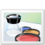 | 159 | imageres.dll |
|  | 160 | imageres.dll |
|  | 161 | imageres.dll |
|  | 162 | imageres.dll |
|  | 163 | imageres.dll |
|  | 164 | imageres.dll |
|  | 165 | imageres.dll |
|  | 166 | imageres.dll |
|  | 167 | imageres.dll |
|  | 168 | imageres.dll |
|  | 169 | imageres.dll |
|  | 170 | imageres.dll |
|  | 171 | imageres.dll |
|  | 172 | imageres.dll |
|  | 173 | imageres.dll |
|  | 174 | imageres.dll |
|  | 175 | imageres.dll |
|  | 176 | imageres.dll |
|  | 177 | imageres.dll |
|  | 178 | imageres.dll |
|  | 179 | imageres.dll |
|  | 180 | imageres.dll |
|  | 181 | imageres.dll |
|  | 182 | imageres.dll |
|  | 183 | imageres.dll |
|  | 184 | imageres.dll |
|  | 185 | imageres.dll |
|  | 186 | imageres.dll |
|  | 187 | imageres.dll |
|  | 188 | imageres.dll |
|  | 189 | imageres.dll |
|  | 190 | imageres.dll |
|  | 191 | imageres.dll |
|  | 192 | imageres.dll |
|  | 193 | imageres.dll |
|  | 194 | imageres.dll |
|  | 195 | imageres.dll |
|  | 196 | imageres.dll |
|  | 197 | imageres.dll |
|  | 198 | imageres.dll |
|  | 199 | imageres.dll |
|  | 200 | imageres.dll |
|  | 201 | imageres.dll |
|  | 202 | imageres.dll |
|  | 203 | imageres.dll |
|  | 204 | imageres.dll |
|  | 205 | imageres.dll |
|  | 206 | imageres.dll |
|  | 207 | imageres.dll |
|  | 208 | imageres.dll |
|  | 209 | imageres.dll |
|  | 210 | imageres.dll |
|  | 211 | imageres.dll |
|  | 212 | imageres.dll |
|  | 213 | imageres.dll |
|  | 214 | imageres.dll |
|  | 215 | imageres.dll |
|  | 216 | imageres.dll |
|  | 217 | imageres.dll |
|  | 218 | imageres.dll |
|  | 219 | imageres.dll |
|  | 220 | imageres.dll |
|  | 221 | imageres.dll |
|  | 222 | imageres.dll |
|  | 223 | imageres.dll |
|  | 224 | imageres.dll |
|  | 225 | imageres.dll |
|  | 226 | imageres.dll |
|  | 227 | imageres.dll |
|  | 228 | imageres.dll |
|  | 229 | imageres.dll |
|  | 230 | imageres.dll |
|  | 231 | imageres.dll |
|  | 232 | imageres.dll |
|  | 233 | imageres.dll |
|  | 234 | imageres.dll |
|  | 235 | imageres.dll |
|  | 236 | imageres.dll |
|  | 237 | imageres.dll |
|  | 238 | imageres.dll |
|  | 239 | imageres.dll |
|  | 240 | imageres.dll |
|  | 241 | imageres.dll |
|  | 242 | imageres.dll |
|  | 243 | imageres.dll |
|  | 244 | imageres.dll |
|  | 245 | imageres.dll |
|  | 246 | imageres.dll |
|  | 247 | imageres.dll |
|  | 248 | imageres.dll |
|  | 249 | imageres.dll |
|  | 250 | imageres.dll |
|  | 251 | imageres.dll |
|  | 252 | imageres.dll |
|  | 253 | imageres.dll |
|  | 254 | imageres.dll |
|  | 255 | imageres.dll |
|  | 256 | imageres.dll |
|  | 257 | imageres.dll |
|  | 258 | imageres.dll |
|  | 259 | imageres.dll |
|  | 260 | imageres.dll |
|  | 261 | imageres.dll |
|  | 262 | imageres.dll |
| 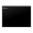 | 263 | imageres.dll |
|  | 264 | imageres.dll |
|  | 265 | imageres.dll |
|  | 266 | imageres.dll |
|  | 267 | imageres.dll |
|  | 268 | imageres.dll |
|  | 269 | imageres.dll |
|  | 270 | imageres.dll |
|  | 271 | imageres.dll |
|  | 272 | imageres.dll |
|  | 273 | imageres.dll |
|  | 274 | imageres.dll |
|  | 275 | imageres.dll |
|  | 276 | imageres.dll |
|  | 277 | imageres.dll |
|  | 278 | imageres.dll |
|  | 279 | imageres.dll |
|  | 280 | imageres.dll |
|  | 281 | imageres.dll |
|  | 282 | imageres.dll |
|  | 283 | imageres.dll |
|  | 284 | imageres.dll |
|  | 285 | imageres.dll |
|  | 286 | imageres.dll |
|  | 287 | imageres.dll |
|  | 288 | imageres.dll |
|  | 289 | imageres.dll |
|  | 290 | imageres.dll |
|  | 291 | imageres.dll |
|  | 292 | imageres.dll |
|  | 293 | imageres.dll |
|  | 294 | imageres.dll |
|  | 295 | imageres.dll |
|  | 296 | imageres.dll |
|  | 297 | imageres.dll |
|  | 298 | imageres.dll |
|  | 299 | imageres.dll |
|  | 300 | imageres.dll |
| 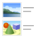 | 301 | imageres.dll |
|  | 302 | imageres.dll |
|  | 303 | imageres.dll |
|  | 304 | imageres.dll |
|  | 305 | imageres.dll |
|  | 306 | imageres.dll |
|  | 307 | imageres.dll |
|  | 308 | imageres.dll |
|  | 309 | imageres.dll |
| 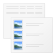 | 310 | imageres.dll |
|  | 311 | imageres.dll |
|  | 312 | imageres.dll |
|  | 313 | imageres.dll |
|  | 314 | imageres.dll |
|  | 315 | imageres.dll |
|  | 316 | imageres.dll |
|  | 317 | imageres.dll |
|  | 318 | imageres.dll |
|  | 319 | imageres.dll |
|  | 320 | imageres.dll |
|  | 321 | imageres.dll |
|  | 322 | imageres.dll |
|  | 323 | imageres.dll |
|  | 324 | imageres.dll |
|  | 325 | imageres.dll |
|  | 326 | imageres.dll |
|  | 327 | imageres.dll |
|  | 328 | imageres.dll |
|  | 329 | imageres.dll |
|  | 330 | imageres.dll |
|  | 331 | imageres.dll |
|  | 332 | imageres.dll |
|  | 333 | imageres.dll |
|  | 334 | imageres.dll |
|  | 335 | imageres.dll |
|  | 336 | imageres.dll |
|  | 337 | imageres.dll |
|  | 338 | imageres.dll |
|  | 339 | imageres.dll |
|  | 340 | imageres.dll |
|  | 341 | imageres.dll |
|  | 342 | imageres.dll |
|  | 343 | imageres.dll |
|  | 344 | imageres.dll |
|  | 345 | imageres.dll |
|  | 346 | imageres.dll |
|  | 347 | imageres.dll |
|  | 348 | imageres.dll |
|  | 349 | imageres.dll |
|  | 350 | imageres.dll |
|  | 351 | imageres.dll |
|  | 352 | imageres.dll |
|  | 353 | imageres.dll |
|  | 354 | imageres.dll |
|  | 355 | imageres.dll |
|  | 356 | imageres.dll |
|  | 357 | imageres.dll |
|  | 358 | imageres.dll |
|  | 000 | shell32.dll |
|  | 001 | shell32.dll |
|  | 002 | shell32.dll |
|  | 003 | shell32.dll |
|  | 004 | shell32.dll |
|  | 005 | shell32.dll |
|  | 006 | shell32.dll |
|  | 007 | shell32.dll |
|  | 008 | shell32.dll |
|  | 009 | shell32.dll |
|  | 010 | shell32.dll |
|  | 011 | shell32.dll |
|  | 012 | shell32.dll |
|  | 013 | shell32.dll |
|  | 014 | shell32.dll |
|  | 015 | shell32.dll |
|  | 016 | shell32.dll |
|  | 017 | shell32.dll |
| 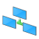 | 018 | shell32.dll |
|  | 019 | shell32.dll |
|  | 020 | shell32.dll |
|  | 021 | shell32.dll |
|  | 022 | shell32.dll |
|  | 023 | shell32.dll |
|  | 024 | shell32.dll |
|  | 025 | shell32.dll |
|  | 026 | shell32.dll |
|  | 027 | shell32.dll |
|  | 028 | shell32.dll |
|  | 029 | shell32.dll |
|  | 030 | shell32.dll |
|  | 031 | shell32.dll |
|  | 032 | shell32.dll |
| 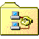 | 033 | shell32.dll |
|  | 034 | shell32.dll |
| 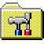 | 035 | shell32.dll |
|  | 036 | shell32.dll |
| 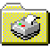 | 037 | shell32.dll |
|  | 038 | shell32.dll |
|  | 039 | shell32.dll |
|  | 040 | shell32.dll |
|  | 041 | shell32.dll |
|  | 042 | shell32.dll |
|  | 043 | shell32.dll |
|  | 044 | shell32.dll |
|  | 045 | shell32.dll |
|  | 046 | shell32.dll |
|  | 047 | shell32.dll |
|  | 048 | shell32.dll |
|  | 049 | shell32.dll |
|  | 050 | shell32.dll |
|  | 051 | shell32.dll |
|  | 052 | shell32.dll |
|  | 053 | shell32.dll |
|  | 054 | shell32.dll |
|  | 055 | shell32.dll |
|  | 056 | shell32.dll |
|  | 057 | shell32.dll |
|  | 058 | shell32.dll |
|  | 059 | shell32.dll |
|  | 060 | shell32.dll |
|  | 061 | shell32.dll |
|  | 062 | shell32.dll |
|  | 063 | shell32.dll |
|  | 064 | shell32.dll |
|  | 065 | shell32.dll |
|  | 066 | shell32.dll |
|  | 067 | shell32.dll |
|  | 068 | shell32.dll |
|  | 069 | shell32.dll |
|  | 070 | shell32.dll |
|  | 071 | shell32.dll |
|  | 072 | shell32.dll |
|  | 073 | shell32.dll |
|  | 074 | shell32.dll |
|  | 075 | shell32.dll |
|  | 076 | shell32.dll |
|  | 077 | shell32.dll |
|  | 078 | shell32.dll |
|  | 079 | shell32.dll |
|  | 080 | shell32.dll |
|  | 081 | shell32.dll |
|  | 082 | shell32.dll |
|  | 083 | shell32.dll |
|  | 084 | shell32.dll |
|  | 085 | shell32.dll |
|  | 086 | shell32.dll |
|  | 087 | shell32.dll |
|  | 088 | shell32.dll |
|  | 089 | shell32.dll |
| 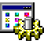 | 090 | shell32.dll |
|  | 091 | shell32.dll |
|  | 092 | shell32.dll |
|  | 093 | shell32.dll |
|  | 094 | shell32.dll |
|  | 095 | shell32.dll |
|  | 096 | shell32.dll |
|  | 097 | shell32.dll |
|  | 098 | shell32.dll |
|  | 099 | shell32.dll |
|  | 100 | shell32.dll |
|  | 101 | shell32.dll |
|  | 102 | shell32.dll |
|  | 103 | shell32.dll |
|  | 104 | shell32.dll |
|  | 105 | shell32.dll |
|  | 106 | shell32.dll |
|  | 107 | shell32.dll |
|  | 108 | shell32.dll |
|  | 109 | shell32.dll |
|  | 110 | shell32.dll |
|  | 111 | shell32.dll |
|  | 112 | shell32.dll |
|  | 113 | shell32.dll |
|  | 114 | shell32.dll |
|  | 115 | shell32.dll |
|  | 116 | shell32.dll |
|  | 117 | shell32.dll |
|  | 118 | shell32.dll |
|  | 119 | shell32.dll |
|  | 120 | shell32.dll |
|  | 121 | shell32.dll |
|  | 122 | shell32.dll |
|  | 123 | shell32.dll |
|  | 124 | shell32.dll |
|  | 125 | shell32.dll |
|  | 126 | shell32.dll |
|  | 127 | shell32.dll |
|  | 128 | shell32.dll |
|  | 129 | shell32.dll |
|  | 130 | shell32.dll |
|  | 131 | shell32.dll |
|  | 132 | shell32.dll |
|  | 133 | shell32.dll |
|  | 134 | shell32.dll |
|  | 135 | shell32.dll |
|  | 136 | shell32.dll |
|  | 137 | shell32.dll |
|  | 138 | shell32.dll |
|  | 139 | shell32.dll |
|  | 140 | shell32.dll |
|  | 141 | shell32.dll |
|  | 142 | shell32.dll |
|  | 143 | shell32.dll |
|  | 144 | shell32.dll |
|  | 145 | shell32.dll |
|  | 146 | shell32.dll |
|  | 147 | shell32.dll |
|  | 148 | shell32.dll |
|  | 149 | shell32.dll |
|  | 150 | shell32.dll |
|  | 151 | shell32.dll |
|  | 152 | shell32.dll |
|  | 153 | shell32.dll |
|  | 154 | shell32.dll |
|  | 155 | shell32.dll |
|  | 156 | shell32.dll |
|  | 157 | shell32.dll |
|  | 158 | shell32.dll |
|  | 159 | shell32.dll |
|  | 160 | shell32.dll |
|  | 161 | shell32.dll |
|  | 162 | shell32.dll |
|  | 163 | shell32.dll |
|  | 164 | shell32.dll |
|  | 165 | shell32.dll |
|  | 166 | shell32.dll |
|  | 167 | shell32.dll |
|  | 168 | shell32.dll |
|  | 169 | shell32.dll |
|  | 170 | shell32.dll |
|  | 171 | shell32.dll |
|  | 172 | shell32.dll |
|  | 173 | shell32.dll |
|  | 174 | shell32.dll |
|  | 175 | shell32.dll |
|  | 176 | shell32.dll |
|  | 177 | shell32.dll |
|  | 178 | shell32.dll |
|  | 179 | shell32.dll |
|  | 180 | shell32.dll |
|  | 181 | shell32.dll |
|  | 182 | shell32.dll |
|  | 183 | shell32.dll |
|  | 184 | shell32.dll |
|  | 185 | shell32.dll |
|  | 186 | shell32.dll |
|  | 187 | shell32.dll |
|  | 188 | shell32.dll |
|  | 189 | shell32.dll |
|  | 190 | shell32.dll |
|  | 191 | shell32.dll |
|  | 192 | shell32.dll |
|  | 193 | shell32.dll |
|  | 194 | shell32.dll |
|  | 195 | shell32.dll |
|  | 196 | shell32.dll |
|  | 197 | shell32.dll |
|  | 198 | shell32.dll |
|  | 199 | shell32.dll |
|  | 200 | shell32.dll |
|  | 201 | shell32.dll |
|  | 202 | shell32.dll |
|  | 203 | shell32.dll |
|  | 204 | shell32.dll |
|  | 205 | shell32.dll |
|  | 206 | shell32.dll |
|  | 207 | shell32.dll |
|  | 208 | shell32.dll |
|  | 209 | shell32.dll |
|  | 210 | shell32.dll |
|  | 211 | shell32.dll |
|  | 212 | shell32.dll |
|  | 213 | shell32.dll |
|  | 214 | shell32.dll |
|  | 215 | shell32.dll |
|  | 216 | shell32.dll |
|  | 217 | shell32.dll |
|  | 218 | shell32.dll |
|  | 219 | shell32.dll |
|  | 220 | shell32.dll |
|  | 221 | shell32.dll |
|  | 222 | shell32.dll |
|  | 223 | shell32.dll |
|  | 224 | shell32.dll |
|  | 225 | shell32.dll |
|  | 226 | shell32.dll |
|  | 227 | shell32.dll |
|  | 228 | shell32.dll |
|  | 229 | shell32.dll |
|  | 230 | shell32.dll |
|  | 231 | shell32.dll |
|  | 232 | shell32.dll |
|  | 233 | shell32.dll |
|  | 234 | shell32.dll |
|  | 235 | shell32.dll |
|  | 236 | shell32.dll |
|  | 237 | shell32.dll |
|  | 238 | shell32.dll |
|  | 239 | shell32.dll |
|  | 240 | shell32.dll |
|  | 241 | shell32.dll |
|  | 242 | shell32.dll |
| 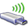 | 243 | shell32.dll |
|  | 244 | shell32.dll |
|  | 245 | shell32.dll |
|  | 246 | shell32.dll |
|  | 247 | shell32.dll |
|  | 248 | shell32.dll |
|  | 249 | shell32.dll |
|  | 250 | shell32.dll |
|  | 251 | shell32.dll |
|  | 252 | shell32.dll |
|  | 253 | shell32.dll |
|  | 254 | shell32.dll |
|  | 255 | shell32.dll |
|  | 256 | shell32.dll |
|  | 257 | shell32.dll |
|  | 258 | shell32.dll |
|  | 259 | shell32.dll |
|  | 260 | shell32.dll |
|  | 261 | shell32.dll |
|  | 262 | shell32.dll |
|  | 263 | shell32.dll |
|  | 264 | shell32.dll |
|  | 265 | shell32.dll |
|  | 266 | shell32.dll |
|  | 267 | shell32.dll |
|  | 268 | shell32.dll |
|  | 269 | shell32.dll |
|  | 270 | shell32.dll |
|  | 271 | shell32.dll |
|  | 272 | shell32.dll |
|  | 273 | shell32.dll |
|  | 274 | shell32.dll |
|  | 275 | shell32.dll |
|  | 276 | shell32.dll |
|  | 277 | shell32.dll |
|  | 278 | shell32.dll |
|  | 279 | shell32.dll |
|  | 280 | shell32.dll |
|  | 281 | shell32.dll |
|  | 282 | shell32.dll |
|  | 283 | shell32.dll |
|  | 284 | shell32.dll |
|  | 285 | shell32.dll |
|  | 286 | shell32.dll |
|  | 287 | shell32.dll |
|  | 288 | shell32.dll |
|  | 289 | shell32.dll |
|  | 290 | shell32.dll |
|  | 291 | shell32.dll |
|  | 292 | shell32.dll |
|  | 293 | shell32.dll |
|  | 294 | shell32.dll |
|  | 295 | shell32.dll |
|  | 296 | shell32.dll |
|  | 297 | shell32.dll |
|  | 298 | shell32.dll |
|  | 299 | shell32.dll |
|  | 300 | shell32.dll |
|  | 301 | shell32.dll |
|  | 302 | shell32.dll |
|  | 303 | shell32.dll |
|  | 304 | shell32.dll |
|  | 305 | shell32.dll |
|  | 306 | shell32.dll |
|  | 307 | shell32.dll |
|  | 308 | shell32.dll |
|  | 309 | shell32.dll |
|  | 310 | shell32.dll |
|  | 311 | shell32.dll |
|  | 312 | shell32.dll |
|  | 313 | shell32.dll |
|  | 314 | shell32.dll |
|  | 315 | shell32.dll |
|  | 316 | shell32.dll |
|  | 317 | shell32.dll |
|  | 318 | shell32.dll |
|  | 319 | shell32.dll |
|  | 320 | shell32.dll |
|  | 321 | shell32.dll |
|  | 322 | shell32.dll |
|  | 323 | shell32.dll |
|  | 324 | shell32.dll |
|  | 325 | shell32.dll |
|  | 326 | shell32.dll |