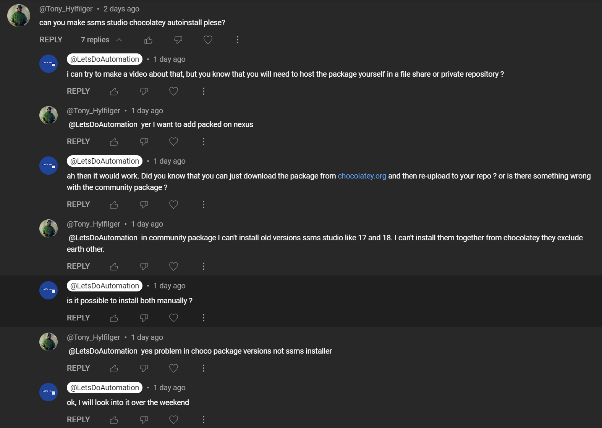

# Chocolatey: Modifying community packages to install multiple versions

<b>Chocolatey community packages:</b>

[SQL Server Management Studio](https://community.chocolatey.org/packages?q=ssms)

<b>Video reason:</b>

<b>Objectives:</b>

* Split single community package in multiple packages

### Related videos:

[Windows tools: Download and install NuGet Package Explorer](https://youtu.be/94u9jDCpifM)
[Chocolatey video playlist](https://www.youtube.com/playlist?list=PLVncjTDMNQ4TMCZqT4EJEtOGzwj6pvQKl)